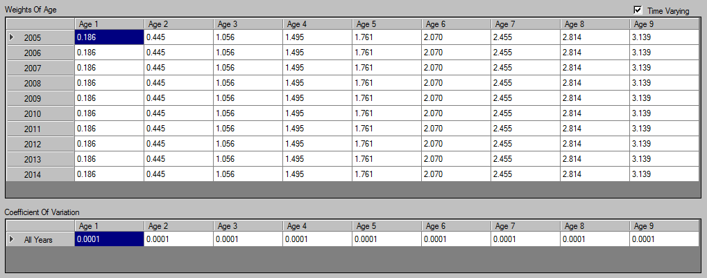
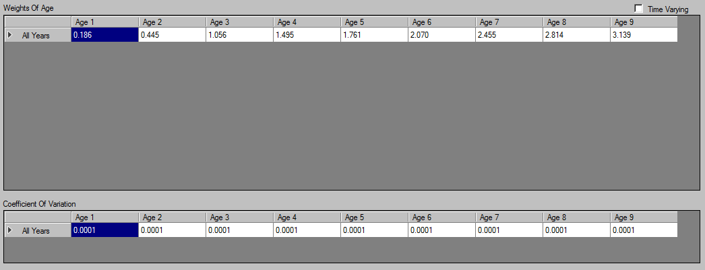
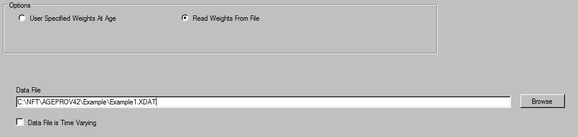
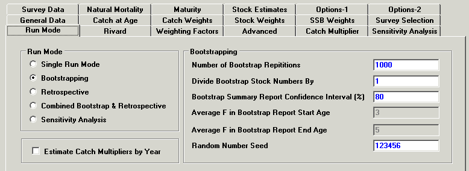
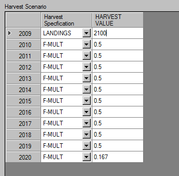
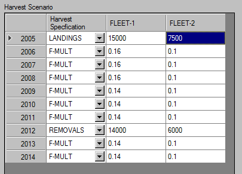
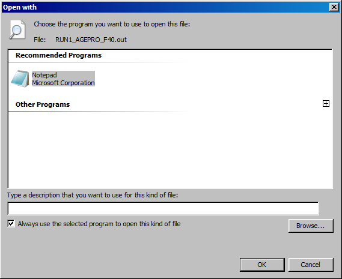

Age Structured Projection Model (AGEPRO)
========================================

# Getting Started
# Creating a new Case

# Opening an Existing AGEPRO Input Data File

# Saving AGEPRO input into file


 

# Using NFT Data Grids
NOAA Fisheries Toolbox data grids have many functions that are similar to spreadsheet software programs. However, there are a few differences and limitations. The following topics will  describe in detail how to perform common tasks.

Right-clicking on the cell to show the Cut, Copy, Paste and Delete options.

###  Selecting Cells
To select a single cell: Click the cell, or press one of the Arrow keys to move to the cell.

To select more than one cell: Click the on the cell, and while holding the mouse button drag the pointer to the cell in the range of cells you are interested in.

To select an entire row, click on the row heading.

To select the entire grid, do one of the following:
* Right-Click on the grid and select Select All from the context menu.
* Press CTRL+A.
* Click the top left grid cell.

### Edit Cell Contents
You can edit the contents of a cell directly in the cell.

To place the contents of a cell in editing mode:
* Double-click the cell that contains the data that you want to edit. Note that the cursor will be at the end of the cell's contents.
* Click the cell that contains the data that you want to edit, and then start typing. If the cell contained any data it will be erased when you start typing.

While the cell is still in edit mode, use **Esc** key to cancel the edit. It will revert to previous value before it was entered.

To commit the edits to the cell:
* Hit the **Enter** key to commit the changes and move the cell selection one cell below.
* Hit the **Up** Arrow key to commit the changes and move the cell selection one cell above.
* Hit the **Down** Arrow key to commit the changes and move to the cell selection one cell below.
* If you are at the last character, hitting the **Right** Arrow key will commit the edit and move the cell selection one cell to the right.
* If you are at the first character, hit the **Left** Arrow key will commit the edit and move the cell selection one cell to the left.

### Copy Grid Data
Select a cell or range of cells. Either **Right-Click** on the grid and select Copy from the context  menu, or use **CTRL+C**.

### Paste Grid Data
If you want to paste data from a spreadsheet program, select and copy the range of cells within  the spreadsheet program. The copied cells will be stored to the clipboard.  You can also paste data from a text file. Data in a text file should be tab-delimited, rows are line-delimited.

To select where you want the data to be pasted, do one of the following:
* If you have just one cell of data to paste, click on the cell where you want the data to go.
* If you have more than one cell of data to paste, click on the cell you want to be the topmost and leftmost cell of the pasted data. Pasted data will automatically be filled in to the right of and below the cell you select.

To paste the data, either **Right-Click** on the grid and select Copy from the context menu, or use **CTRL+V**.

### Cut Grid Data
Select a cell or range of cells. Either **Right-Click** on the grid and select Cut from the context menu, or use **CTRL+X**.

The selected cells will be cleared and will be sent to the Windows clipboard.

### Delete Grid Data
The Delete function clears all data in the selected cells. Unlike Cut, It does *not* copy the grid cells to the Windows clipboard.

Select a cell or range of cells. Either **Right-Click** on the grid and select Delete from the context menu, or use the **Delete** key.

### Fill Data in Grid Cells
Select Fill Blank Cells from the context menu. This will populate any blanks cell from the data grid with “0”.


 

# Stochastic Age
# Specifying Weights of Age
AGEPRO allows the user to input stochastic weights at age.  

From the navigation panel, expand the **Weights if Age** node to set the following stochastic weights of age:
* JAN-1
* SSB
* Mid-Year (Mean)
* Catch
* Discard

If *Discards are present* in **General Options** was unchecked or disabled, controls from *Discard* will be disabled.

## JAN-1 Stock Weights at Age
On the JAN-1 Weights panel, the user can select a data preference:

* User Specfied Weights of Age
* Read Weights from File

The user may select to input mean weights at age and apply log-normal error on each observed value, or to read in [stochastic data from a file](#stochastic-data-files).

Furthermore, the user specifies whether the data supplied by either method will be supplied for each year in the time horizon as *time varying*. Otherwise, the data or to use a single set of weights at age for all years.

### Examples


In this first example, *Time Varying* is enabled. The user supplies mean weights at age for each year in the time horizon. In addition, the user also specifies a coefficient of variation for each age.

Log-Normal error with bias correction will be calculated and applied on each observed value for each year in the time horizon



In the next example, *Time Varying* is not enabled. The user will supply a single vector of mean values for weights at age.  The program will apply error on to he data supplied as above, but the data with error will not vary through the time horizon.



In this example, the user has selected to supply [data from an external file](#stochastic-data-files) with data for each observed value. Use the browse button to bring up a Windows File Dialog from which the user may select the source data file.  No further input is required.

## Spawning Stock Weights at Age
When the user selects **SSB** from the navigation panel, the user can select from the following:

Label                         | Description
------------------------------|-----------------------------------------------
User Specfied Weights of Age  | Input Mean Weights at Age and apply Log-Normal error to the data either time varying or not
Read Weights from File        | Read the Weights at age with Stochastic error from an external file
Use JAN-1 Weights At Age      | Use the Jan-1 Stock Weights at Age

**User Specfied Weights of Age** and **Read Weights from File** options has been described in the section [*JAN-1 Stock Weights of Age*](#jan-1-stock-weights-of-age) above.

## Mid-Year Stock Weights at Age
When the user selects **Mid-Year (Mean)** from the navigation panel, the user can select from the following:

Label                         | Description
------------------------------|-----------------------------------------------
User Specfied Weights of Age  | Input Mean Weights at Age and apply Log-Normal error to the data either time varying or not
Read Weights from File        | Read the Weights at age with Stochastic error from an external file
Use JAN-1 Weights At Age      | Use the Jan-1 Stock Weights at Age
Use SSB Weights At Age        | Use the Spawning Stock Weights at Age

**User Specfied Weights of Age** and **Read Weights from File** options has been described in the section [*JAN-1 Stock Weights of Age*](#jan-1-stock-weights-of-age) above.

## Catch Weights at Age
When the user selects **Catch** from the navigation panel, the user can select from the following:

Label                        | Description
-----------------------------|-----------------------------------------------
User Specfied Weights of Age | Input Mean Weights at Age for **each fleet** and apply Log-Normal error for **each fleet** to the data either time varying or not
Read Weights from File       | Read the Weights at age with Stochastic error from an external file
Use JAN-1 Weights At Age     | Use the Jan-1 Stock Weights at Age and apply to all fleets
Use SSB Weights At Age       | Use the Spawning Stock Weights at Age and apply to all fleets
Use Mid-Year Weights At Age  | Use the Mid-Year Stock Weights at age and apply to all fleets

**User Specfied Weights of Age** and **Read Weights from File** options has been described in the section [*JAN-1 Stock Weights of Age*](#jan-1-stock-weights-of-age) above.

## Discard Weights at Age
If *Discards are present* in **General Options** was unchecked or disabled, controls from this weight of age will be disabled.

When the user selects **Discard** from the navigation panel, the user *may* select from the following:

Label                        | Description
-----------------------------|-----------------------------------------------
User Specfied Weights of Age | Input Mean Weights at Age for **each fleet** and apply Log-Normal error for **each fleet** to the data either time varying or not
Read Weights from File       | Read the Weights at age with Stochastic error from an external file
Use JAN-1 Weights At Age     | Use the Jan-1 Stock Weights at Age and apply to all fleets
Use SSB Weights At Age       | Use the Spawning Stock Weights at Age and apply to all fleets
Use Mid-Year Weights At Age  | Use the Mid-Year Stock Weights at age and apply to all fleets
Use Catch Weights At Age     | Use the Catch Weights at Age for each fleet

**User Specfied Weights of Age** and **Read Weights from File** options has been described in the section [*JAN-1 Stock Weights of Age*](#jan-1-stock-weights-of-age) above.

# Stochastic Data Files

# Natural Mortality
# Biological
## Maturity
## Fraction Mortality Prior to Spawning
# Fishery Selectivity
# Discard Fraction

# Bootstrap
Bootstrapping input and options is located on the **Bootstrapping** panel.

The user must input the **Number of Bootstrap iterations**. Each line in the Bootstrap file represents a bootstrap iteration, consisting of space delimited stock values at age as double precision numeric values. The number of data values on each row line must be equal to the number of age classes.

The number of rows in the bootstrap file must be at least equal to the **number of bootstrap iterations**. Since it contains the population of the first year in the projection.

AGEPRO, will ignore additional iterations or bootstrap data intended for addtional projection years.

For each bootstrap iteration the stock values at age in the file will be multiplied by the **Population Scaling Factor**. For example, a population scale factor of `1000` means that a bootstrap file contains stock values at age equal to thousands of fish.

AGEPRO versions 3.4 and later do not support recruitment ages beyond age 1, therefore the second bootstrap file with Bootstrap F's in earlier versions is no longer used.  

### Scaling factors with VPA(Virtual Population Analysis)
Typically, bootstrap files are generated by the **VPA(Virtual Population Analysis)** or **ASAP(Age Structured Assessment Program)** Models. It is imperative that the user be consistent between VPA or ASAP runs and AGEPRO.

In the following example, the **VPA program input** generates a bootstrap population file which uses a scaling factor of `1`. Thus, if this were the **VPA** file used to create for **AGEPRO** input, with AGEPRO's **Population Scaling Factor** of `1000`, then it will imply that the **VPA Catch data** was in **thousands** of fish.


# Recruitment
# Specifying Recruitment
AGEPRO supports multiple recruitment methods. The number of recruitment methods can be specified in the **General Options** panel.

Under **Select Recruitment Models** is a DataGrid object with combo box(es). The number of recruitment methods determines the number of combobox selections.

The combobox will be populated with the following models:

* Model 1: Markov Matrix
* Model 2: Empirical Recruits per Spawning Biomass Distribution
* Model 3: Empirical Recruitment Distribution
* Model 4: Two-Stage Empirical Recruits per Spawning Biomass Distribution
* Model 5: Beverton-Holt Curve w/ Lognormal Error
* Model 6: Ricker Curve w/ Lognormal Error
* Model 7: Shepherd Curve w/ Lognormal Error
* Model 8: Lognormal Distribution
* Model 10: Beverton-Holt Curve w/ Autocorrected Lognormal Error
* Model 11: Ricker Curve w/ Autocorrected Lognormal Error
* Model 12: Shepherd Curve w/ Autocorrected Lognormal Error
* Model 13: Autocorrected Lognormal Distribution
* Model 14: Empirical Cumulative Distribution Function of Recruitment
* Model 15: Two-Stage Empirical Cumulative Distribution Function of Recruitment
* Model 16: Linear Recruits per Spawning Biomass Predictor w/ Normal Error
* Model 17: Loglinear Recruits per Spawning Biomass Predictor w/ Lognormal Error
* Model 18: Linear Recruitment Predictor w/ Normal Error
* Model 19: Loglinear Recruitment Predictor w/ Lognormal Error
* Model 20: Fixed Recruitment
* Model 21: Empirical Cumulative Distribution Function of Recruitment w/ Linear Decline to Zero

The user can choose multiple instances of a Recruitment Model (example: All 3 Recruitment Models can be a Beverton-Holt Curve Model). ***However, Only a single instance of the Markov Matrix model is allowed.***

Note: Model 9: Time-Varying Empirical Recruitment Distribution is not supported in AGEPRO version 4.0 and later. This model can be reimplemented by specifying multiple instances of Model 3.

## Recruitment Probability
Each model selection is given a probability in each year of the projection time horizon. In each realization, and each year in the projection time horizon, a single recruitment method is randomly selected from a multinomial distribution.   

For each year (row), the Recruitment Probably selections (columns) must sum up to 1.0.

## Specifying Scaling Factors for Recruitment and SSB
**Recruitment Scaling Factor** and **SSB Scaling Factor** are explicit scaling factors that is applied to recruitment models. The calculated recruitment from the model will be *multiplied by the Recruitment Scaling Factor* before it is outputted to the user. The calculated Spawning Stock Biomass will be *divided by the SSB Scaling Factor* for use within recruitment model calculations.

Recruitment Scaling Factor scales in number of fish (for recruit values in Recruitment Model parameters). SSB Scaling Factor scales in Metric Tons (for SSB/biomass values in Recruitment Model parameters).

## Specifying the First Recruitment Age class
The user has the option to select either **Age 0** or **Age 1** as the first recruitment age class in General options panel. The default is **Age 1** recruitment.

For **Age 1 Recruitment**, the calculated recruitment is introduced into the first Age Class in the subsequent year.  

In those methods in which Recruitment is a function of Spawning **Stock Biomass, the stock numbers in the first Age class in Year T+1 will be equal to the predicted recruitment based on SSB in Year T**.

If **Age 0 Recruitment** is selected, the calculated recruitment is introduced into the first Age Class in the current year for all years except the first year in the time horizon.

For those recruitment methods in which Recruitment is a function of Spawning Stock Biomass, the **stock numbers for Age 0 in Year T will be equal to The predicted recruitment based on SSB in the same Year.**  This rule applies to all years **except the first year** in the time horizon.

AGEPRO does not support first recruitment ages classes beyond 1. 

# Empirical Recruitment Models
When an Empirical Recruitment model type is selected in the the recruitment selection drop down list in the *Recruit Model* tab of the **Recruitment** panel, input parameters for this type of recruitment will appear below.

Empirical Recruitment Models include:

* Model 2. Empirical Recruits Per Spawning Biomass Distribution
* Model 3. Empirical Recruitment Distribution
* Model 4. Two-Stage Empirical Recruits Per Spawning Biomass Distribution
* Model 14. Empirical Cumulative Distribution Function of Recruitment
* Model 15. Two-Stage Empirical Cumulative Distribution Function of Recruitment
* Model 20. Fixed Recruitment
* Model 21. Empirical Cumulative Distribution Function of Recruitment with Linear Decline to Zero

Multiple instances of the same empirical model are allowed. Use the recruitment selection drop down list to toggle between input sets in the Recruit Model tab in the Recruitment panel.

Only numeric data is allowed for Empirical Recruitment models..

**Note**: [The Recruitment Scale Factor](#specifying-scaling-factors-for-recruitment-and-ssb) in the Recruitment tab should be consistent with empirical observations entered.  For example, if the data shown above are empirical observations in millions of fish then the Recruitment Scale Factor must be input as 1,000,000

Enter a new value for the number of observations and click on the SET button to resize the observation tables.

## Fixed Recruitment Method
In the datagrid, the user inputs fixed recruitment values for the projection time horizon **beginning with the 2nd Year.**  Recruitment in the 1st year of the projection time horizon is the value supplied in the bootstrap file for the first age class.

 

# Parametric Recruitment Models
When a Parametric Recruitment model type is selected in the the recruitment selection drop down list in the *Recruit Model* tab of the **Recruitment** panel, input parameters for this type of recruitment will appear below.

Parametric Recruitment Models Include:

* Model 5. Beverton-Holt Curve With Lognormal Error
* Model 6. Ricker Curve With Lognormal Error
* Model 7. Shepherd Curve With Lognormal Error
* Model 8. Lognormal Distribution
* Model 10. Beverton-Holt Curve With Autocorrelated Lognormal Error
* Model 11. Ricker Curve With Autocorrelated Lognormal Error
* Model 12. Shepherd Curve With Autocorrelated Lognormal Error
* Model 13. Autocorrelated Lognormal Distribution

Multiple instances of the same parametric model are allowed.  This would allow the user to, for example, set up multiple Beverton Holt models with different parameters. Use the recruitment selection drop down list to toggle between input sets.

**Note:** Make sure that the scaling of the parametric parameters is consistent with the [SSB and Recruitment Scaling Factors](#specifying-scaling-factors-for-recruitment-and-ssb) on the **Recruitment** tab.


 

# Predictor Recruitment Models
When a predictor recruitment model type is selected in the the recruitment selection drop down list in the *Recruit Model* tab of the **Recruitment** panel, input parameters for this type of recruitment will appear below.

The Predictor Models Include:

* Model 16. Linear Recruits per Spawning Biomass Predictor with Normal Error
* Model 17. Loglinear Recruits per Spawning Biomass Predictor with Lognormal Error
* Model 18. Linear Recruitment Predictor with Normal Error
* Model 19. Loglinear Recruitment Predictor with Lognormal Error

Multiple Instances of the same predictor model are allowed. Use the recruitment selection drop down list to toggle between input sets.

To change the number of predictors, set the value of the *number of recruitment predictors* parameter by typing the value in or using spinbox arrows, and then click on the SET button. The valid number of predictors range from 0-5.

 

# Markov Matrix Recruitment
When **Model 1: Markov Matrix** is selected in the the recruitment selection drop down list in the *Recruit Model* tab of the **Recruitment** panel, input parameters for this type of recruitment will appear below. Only one instance of Markov Matrix recruitment is allowed.

Use the SET button to change the number of levels.

**Note:** The probabilities of each SSB level row in the Probability table must sum up to **1.0**

**Note:** Make sure that the scaling of Recruitment and SSB cutpoint inputs is consistent with the [SSB and Recruitment Scaling Factors](#specifying-scaling-factors-for-recruitment-and-ssb) on the **Recruitment** tab.

 

# Harvest Scenario
The **Harvest Scenario** panel includes a data grid used to determine the level of population harvest for each year in the projection horizon.

In addition, the user may use this data grid for additional harvest calculations such as the **P-Star Analysis**, or Stock **Rebuilder Target**. By default, **None (only Harvest Scenario)** is selected.

## Harvest Scenario Table
In the Harvest Scenario data grid table, the user must specify the *Harvest Specfication* for each year in the projection time horizon. The choices are:
* Landings (MT)
* Removals (Landings and Discards) (MT)
* Total Fishing Mortality or "F-MULT"

For single fleet models, apply the *Harvrest Specfication* values under the *HARVEST VALUE* column. For multiple fleet models, input the values for the intended fleet (e.g. *F-MULT* specfic values for *FLEET-2*). In either case, harvest specification values must be *numeric*.

## Rebuilder Target Option
AGEPRO allows an option for the user to specify a Rebuilder target and calculate the Fishing Mortality level required to meet this target to a specified confidence level.  

Select the **Apply Rebuilder Target** option for *Additional calculations* box in the **Harvest Scenario** panel. The Rebuilder Option input will appear directly below.

> For the Harvest Scenario Table, the *Harvest Specification* from the second year (row 2) in the time horizon to the **Rebuild Target Year** must be set to **F-MULT**

For **Rebuilder Target Type**, the user may set the rebuilder target as:

* Spawning Stock Biomass
* Jan-1 Biomass
* Mean Biomass

If there is more than one fleet then the input estimates will be used to set the proportion of Fishing Mortality in each fleet. This proportion will be held constant as the F-Mult level changes to meet the target.

### Example


In the example shown above the user has set a Landings Harvest Quota in the first year of **2,100 MT**.

The Rebuilder range begins with the second year in the time horizon and ends at the target year **2019**.

The user has also set the Harvest F-Mult in the Rebuilder Range at an initial guess.

The program will vary the F-MULT level in the Rebuilder range until the Rebuilder Specification in the Target Year is met to the confidence level requested.  In this case the user has specified that the Spawning Stock Biomass in 2019 will be at least 43,200 MT with a probability of 75%.

```
Total Fishing Mortality
Year       Average        StdDev
2009        0.0862        0.0154
2010        0.1656        0.0000
2011        0.1656        0.0000
2012        0.1656        0.0000
2013        0.1656        0.0000
2014        0.1656        0.0000
2015        0.1656        0.0000
2016        0.1656        0.0000
2017        0.1656        0.0000
2018        0.1656        0.0000
2019        0.1656        0.0000
2020        0.1670        0.0000
```
The program has set the F-Mult in all years of the rebuilder range to 0.1656

By using a Reference Point Threshold, the user may validate that the target was met (**year 2019**) to the confidence level requested:
```
Probability Spawning Stock Biomass Exceeds Threshold     43.200 (1000 MT)
Year    Probability
2009    0.024250
2010    0.069990
2011    0.159530
2012    0.303640
2013    0.409640
2014    0.521230
2015    0.612170
2016    0.668130
2017    0.705300
2018    0.731610
2019    0.749960
2020    0.761440
Probability Threshold Exceeded at Least Once =     0.9063
```

## P-Star Analysis
**P-Star Analysis** determines *P-Star* (risk of overfishing) at multiple levels.

Select the **Peform P-Star Analysis** option for *Additional calculations* box in the **Harvest Scenario** panel. The P-Star Analysis input will appear directly below. The specification allows the user to specify the number and values of P-Star levels, Overfishing F criteria, and P-Star Target Year. P-Star levels in should be entered in ascending order.

> For the Harvest Scenario Table, the user must set the column *Harvest Specification* to **REMOVALS** (landings and discards) *on the year (row) that* **P-Star Target Year** is set to.

For the multiple fleets scenario, the proportion of removals per fleet will be set by the initial guess and this proportion will be held constant as total removal values are varied to meet the P-Star criteria.

### Example


In the above example, the user has provided an initial guess of total removals of 20,000 MT (`15000` for Fleet-1  + `7500` for Fleet-2). The user has also specified that 70% of the removals are in Fleet-1 and 30 % in Fleet-2.

The Overfishing F is 0.3.  The program will vary the levels of total removals to determine the level of removals required to exceed a Total F of 0.3 with 10%, 25%, and 50% levels of confidence.  

A table of results is reported for all levels

```
PStar Summary Report
Overfishing F =     0.3000   Target Year = 2012
  PStar          TAC
  0.1000        18762
  0.2500        26874
  0.5000        40340
```
The highest P-Star level is used in the final output report.

The highest P-Star level is a combined catch equal to 40,340 MT
```
Probability Total Fishing Mortality Exceeds Threshold     0.3000
Year    Probability
2005    0.443400
2006    0.000000
2007    0.000000
2008    0.000000
2009    0.000000
2010    0.000000
2011    0.000000
2012    0.500000
2013    0.000000
2014    0.000000
Probability Threshold Exceeded at Least Once =     0.7015
```

```
Combined Catch Biomass  x 1000 MT
Year       Average        StdDev
2005       23.8159        0.5280
2006       58.2893       33.4187
2007       90.0363       66.6863
2008       83.3679       56.3227
2009       69.4739       38.4229
2010       57.6585       31.6780
2011       49.4235       26.5478
2012       40.3302        0.4501
2013       37.9428       21.5088
2014       18.6135       15.1005
```

```
Combined Catch Distribution
Year       1 %        5 %        10 %       25 %       50 %       75 %       90 %       95 %       99 %   
2005    23.0242    23.1791    23.2748    23.4553    23.7168    24.0544    24.4621    24.7863    25.6062
2006    20.5261    25.7774    29.6497    38.0500    50.1961    68.2416    92.9632   115.6090   189.9173
2007    24.7738    32.7074    38.7986    51.2893    71.8312   104.0114   160.1893   209.6707   356.1510
2008    24.5674    32.3727    38.1408    49.9449    68.0199    96.3123   145.6537   188.8369   303.7527
2009    23.2500    30.2112    35.0125    45.1508    60.0323    81.9444   112.9818   140.4948   217.4582
2010    19.9632    25.9880    29.9054    37.6155    49.3528    67.7771    95.3417   118.0018   174.5042
2011    18.4318    23.2325    26.2634    32.7304    42.4053    57.6223    80.5782    98.1937   152.4862
2012    40.3401    40.3401    40.3401    40.3401    40.3401    40.3401    40.3401    40.3401    40.3401
2013    10.0895    15.3514    18.2694    24.3797    32.6471    45.5232    63.8322    78.3229   113.7047
2014     2.9045     4.6582     6.0500     9.2075    14.5876    23.0587    35.2707    45.9843    75.4379
```


# AGEPRO Model Job Run

Launching an AGEPRO model marks a new **AGEPRO Model Job Run**.

When the **Launch AGEPRO model** menu option is selected. AGEPRO will check if the form inputs are valid. If valid, it will grab a copy of the bootstrap file, and stores the GUI input under a desginagted **AGEPRO model job run directory** under the `AGEPRO` subdirectory, under the desginagted user document directory (`documents` or `My Documents`). The `AGEPRO` subdirectory will be created if it didn't exist under the document directory.

The **AGEPRO model job run directory** may be entitled two ways. It may take base name given in input file from general options (without file extensions)
appended with a date-time stamp when the model was launched. If input file in general options is blank, then it will generate a random filename (without file extensions) and the date-time stamp this model launched.

Output files generated by the calcuation engine run will be stored at its **AGEPRO model job run directory**.

After the calcuation engine is finished, AGEPRO will open a new window showing the directory the outputs were written to.

# Misc options

## Auxiliary Output Files
AGEPRO includes a set of enhanced auxiliary output files. These files will be saved in their desginagted **AGEPRO Model Job run directory**.

The Auxiliary files follow the naming conventions that are used to make the AGEPRO model job run directory, but have different file extensions.

All auxiliary file data items are space delimited double precision real numbers in scientific notation.

In the following auxiliary files the number of columns is equal to the number of years in the time horizon and the number of rows is equal to the number of observed values. These files are created in all cases.

The number of observed values is equal to the number of bootstrap iterations multiplied by the number of simulations.  

The **units used in the auxiliary files are not affected by the [summary report scaling factors](#/scaling-option-in-output-report)** optionally applied to the report file.

File Extension | Model Items
---------------|------------------------------------------------------
XX1            | [Stock Numbers of Age](#summary-report-of-stock-numbers-of-age) (If **Output Summary Report for Stock Numbers at Age** is enabled)
XX2            | Recruits (Fish)
XX3            | Spawning Stock Biomass (MT)
XX4            | Jan-1 Biomass (MT)
XX5            | Mean Biomass (MT)
XX6            | Catch Biomass (Landings + Discards) (MT)
XX7            | Landings (MT)
XX8            | Discards (MT)
XX9            | F-Mult

If the option **Output Summary Report for Stock Numbers at Age** is enabled, auxiliary file XX1 will be created. This file has stock numbers at age.  The file has a number of columns equal to the number of age classes and a number of rows equal to the number of years in the time horizon multiplied by the number of observed values.

**Please Note**:  The size of the Stock Numbers at Age auxiliary file may be quite large if the numbers at age, number of years in the time horizon, or the number of observed values is large.

###  Multi-Fleet Auxiliary Data File (`*.XX10`)

If there is more than one Fleet then an additional auxiliary file with file extension XX10 will be created.  The number of columns will be equal to the number of years in the time horizon.

The number of data sections will be equal to the number of observed values multiplied by the number of fleets.  

There are four rows in each section by fleet:
* Fishing Mortality
* Combined Catch Biomass
* Landings
* Discards

### Generating Auxiliary Stochastic Data Files  
The user may request that stochastic data at age be saved to auxiliary files on the Options tab.

These stochasitic data files may be read in to subsequent model runs

File Extension | Data Items
---------------|-------------------------------------------------------------
XXX1           | Stock Weights
XXX2           | Spawning Stock Weights
XXX3           | Mid-Year Weights
XXX4           | Catch Weight
XXX5           | Discard Weights
XXX6           | Natural Mortality
XXX7           | Maturity
XXX8           | Fishery Selectivity
XXX9           | Discard Fraction


## Summary Report of Stock Numbers of Age
To request an summry report, check the option **Ouput Summary Report for Stock Numbers at Age**. When enabled, the program will generate a table of stock number distribution at age for each year in the time horizon.

Generating a summary report with a large time horizon and/or large number of age classes is not recommended, since it can affect completeion of the AGEPRO model run.

## Export to R
If **Export Results to R** is enabled, a file will be created in the same directory as the input file, with a name based on the name of the input file except with an `.RDAT` extension. The data in the file is stored in the the R "ddump" format, which is an ASCII representation of an R object.

Data in this format can be read into R using a single "dget" command. In R, you would type something like:
```r
x = dget('myfile.rdat')
```
Where `myfile.rdat` is the name of the file created during the export process.

## Specifying a Specfic Percentile in Output Report
The [Summary Report](#summary-report-of-stock-numbers-of-age) provides tables of the distribution of calculated results at standard distribution intervals including the median. However, a summary report with a specfic percentile that is not equal to the standard distribution internal can be requested.

To create the Percentile Report in the Output File, check the  **Reqest Percentile Report** checkbox option in *Output Options* Section in the **Misc. Options** panel. Then, enter a percentile value between `0.0` and `100.0` in the **Report Percentile** spinbox.

The [summary report scaling units](#/scaling-option-in-output-report) are the same as were are used in the output report with a standard distribution.

### Example
The Output Report will supply values for each year in the time horizon for the calculated results:

```
Requested Percentile Report
Percentile =    60.00 %
                                 2005       2006       2007       2008       2009       2010       2011       2012       2013       2014
Recruits                      61.4121    61.5496    61.4263    61.5560    61.7028    61.5476    61.6189    61.5289    61.6729    61.7721
Spawning Stock Biomass       107.2980   659.3243   683.8850   591.5898   502.6594   444.8396   393.4123   354.1344   314.3024   289.2476
Jan-1 Stock Biomass          438.4464   727.1282   790.1585   703.2796   598.7040   535.7083   478.7315   432.9380   387.1672   360.1825
Mean Biomass                 387.3808   634.6203   663.1946   573.3694   493.5514   441.9435   396.9153   359.6175   322.4296   300.5405
Combined Catch Biomass        23.0890    54.3665   114.6540   134.2215   101.8851    89.4593    76.8770    67.2651    58.7692    53.3587
Landings                      22.5330    52.7181   113.5268   132.7871   100.7810    88.4612    75.9868    66.4783    58.0849    52.7141
Discards                       0.5560     1.6155     1.1014     1.3975     1.0788     0.9637     0.8638     0.7737     0.6854     0.6333
FMort                          0.1869     0.2600     0.2600     0.2600     0.2400     0.2400     0.2400     0.2400     0.2400     0.2400
Stock Numbers at Age
Age 1                         12.3924    61.4121    61.5496    61.4263    61.5560    61.7028    61.5476    61.6189    61.5289    61.6729
Age 2                        723.4452    10.1231    50.1152    50.2031    50.1283    50.2243    50.3180    50.1996    50.2535    50.2007
Age 3                          0.9338   582.7218     8.1089    40.1317    40.2213    40.2209    40.2942    40.3655    40.2727    40.3275
Age 4                          3.0425     0.7365   451.5521     6.2816    31.1053    31.3186    31.3142    31.3677    31.4161    31.3529
Age 5                         37.3769     2.2338     0.5131   314.5587     4.3710    21.9489    22.0933    22.0963    22.1299    22.1605
Age 6                          6.0544    25.7380     1.4098     0.3240   198.6922     2.8168    14.1379    14.2306    14.2335    14.2576
Age 7                          7.7116     4.1326    16.2468     0.8896     0.2044   127.9874     1.8151     9.1085     9.1620     9.1677
Age 8                          1.2546     5.2943     2.6091    10.2540     0.5615     0.1316    82.4348     1.1680     5.8667     5.9029
Age 9                          4.4207     3.8955     5.7163     5.2276     9.6713     6.5808     4.3209    55.6507    36.6454    28.0549
```


## Reference Point Threshold Report
To request a Reference Point Threshold Report, check the **Enable Reference Point Theshold Report** check box. Then, input the Threshold values desired.

Biomass threshold values are in Metric Tons (MT). If a reference point has a value of zero (`0`), then that portion of the report will be skipped.

The Program will Output a table by year of the probability that the requested threshold will be exceeded.

### Example
In this example, the user entered the values for *Spawning Stock Biomass* as `250300` and for *Fishing Mortality* as `0.26`.

*JAN-1 Stock Biomass* and *Mean Biomass* has value `0`, therefore skipped in the threshold report.
```
Probability Spawning Stock Biomass Exceeds Threshold    250.300 (1000 MT)
Year    Probability
2005    0.000000
2006    0.991000
2007    0.991500
2008    0.980000
2009    0.962900
2010    0.940200
2011    0.901200
2012    0.842400
2013    0.721400
2014    0.616900
Probability Threshold Exceeded at Least Once =     0.9966
```
```
Probability Total Fishing Mortality Exceeds Threshold     0.2600
Year    Probability
2005    0.006500
2006    0.000000
2007    0.000000
2008    0.000000
2009    0.000000
2010    0.000000
2011    0.000000
2012    0.000000
2013    0.000000
2014    0.000000
Probability Threshold Exceeded at Least Once =     0.0065
```

## Scaling Option in Output Report
AGEPRO by default will scale the calculated results for the Summary Report as follows:

Data Type     | Default Report Units
------------- | --------------------------------------------
Biomass       | Metric Tons x 1000
Recruitment   | [Recruitment Scale Factor](#specifying-scaling-factors-for-recruitment-and-ssb)
Stock Numbers | [Bootstrap's](#bootstrap) Population Scale Factor

However, the user may find that these defaults make the data hard to read in the report file. The user may override these defaults by checking the **Specify Scale Factors for Output Report** check box.

**Please Note:** This scaling is only used in the Report File and in Plots within the graphical interface, and does not affect the internal calculations or the auxiliary files.

## Specifying Bounds
The user has an option to override the default maximum bounds values for *Weights of Age* (default: `10.0`) and *Natural Mortality* (default: `1.0`).
This is be enabled by checking the **Specify Bounds** check box.

## Retrospective Adjustment Factors
**Retrospective Adjustment Factors** are applied to the initial population numbers to correct for retrospective bias.
This is an optional parameter, and the user can enable or disable it by checking/unchecking the **Specify Retrospective Adjustment Factors** check box.

The stock numbers in the first year of the projection is read from the Bootstrap File on each bootstrap iteration will be **multiplied by** the retrospective adjustment factors.

## View AGEPRO Output files
The user has as option to use a program to view AGEPRO Output Data (`*.out`), once the AGEPRO calculation engine is finished.

If **System Default** is selected, it will launch a program that AGEPRO Output data files was assoicated to on that system. If that hasn't been estabished, then a dialog window will pop up similar to the following.



To bypass viewing AGEPRO Output data files after a model run, select **None**.
